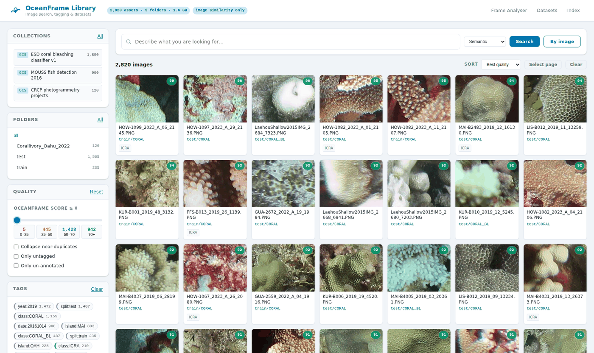
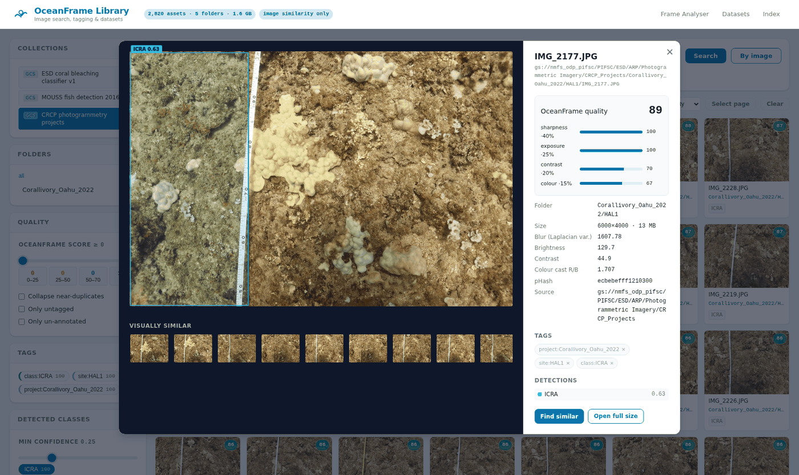

# OceanFrame

OceanFrame is a FastAPI app with two surfaces that share one deployment:

- **`/` — Frame analyser.** Upload a video or an image sequence, score every
  frame for blur, exposure and colour cast, and export the keepers as CSV or ZIP.
- **`/library` — Image library.** Index a Google Cloud Storage bucket (or a local
  tree), search it by visual similarity or text, tag it with YOLO / SAM 3, and
  build training datasets. See [docs/IMAGE_LIBRARY.md](docs/IMAGE_LIBRARY.md).

## Run locally

```bash
pip install -r requirements.txt
python launch.py
```

The app starts on `http://127.0.0.1:80` by default and opens a browser window.

## Run with Docker

```bash
make env          # writes .env with your uid/gid
make up           # http://localhost:8080/library
```

Or without make:

```bash
cp .env.example .env && echo "UID=$(id -u)" >> .env && echo "GID=$(id -g)" >> .env
docker compose up -d --build
```

The container listens on **8080** as a non-root user, so no privileged port and
no root-owned files. State lives in named volumes, and `/healthz` backs a
container healthcheck.

### Profiles

Everything except the app is behind a compose profile, so a plain `up` starts
one container.

| Command | What it does |
| --- | --- |
| `make up` | The app on the core image (451 MB, no torch) |
| `make up-ml` | The app with CLIP, YOLO and SAM 3, on its own port (8081) so it can run alongside `app` |
| `make dev` | Live reload against your working tree |
| `make test` | The offline suite, inside the image |
| `make test-live` | The suite against `gs://nmfs_odp_pifsc` |
| `make quickstart` | Index ~2,800 real NOAA images into the app's volume |
| `make down` / `make clean` | Stop / stop and delete the catalog |

`make help` lists them all. To go from nothing to a real catalog in a browser:

```bash
make quickstart && make up
```

### Two images

`runtime` is the default and carries no model stack: indexing, quality scoring,
image similarity, dedupe, tagging and dataset export all work on the
dependency-free descriptor. `ml` adds torch, CLIP and Ultralytics for semantic
text search and model tagging, and is a separate build target so rebuilding the
app never re-resolves 3 GB of wheels.

Neither image installs any system packages: `requirements.txt` pins
`opencv-python-headless`, which drops the GUI bindings and with them the
`libGL`/`libxcb` dependency. The `ml` target swaps Ultralytics' full
`opencv-python` back out for the same reason — without it `import cv2` fails
inside the container.

### Private buckets

Public buckets need no credentials at all. For a private one, run
`gcloud auth application-default login` and add the overlay:

```bash
docker compose -f docker-compose.yml -f docker-compose.gcloud.yml up -d
```

It is a separate file because bind-mounting a possibly-missing
`~/.config/gcloud` makes Docker create it as a root-owned directory on your host.

For a VM or workstation, `restart: unless-stopped` in
[docker-compose.yml](docker-compose.yml) brings the stack back after a reboot as
long as Docker starts on boot.

## Host bootstrap

Use [cloud_bootstrap.sh](cloud_bootstrap.sh) on a Linux host to install Docker, clone the GitHub repo, start the compose stack, and register a systemd service that brings it back on boot.

Example:

```bash
curl -SL https://raw.githubusercontent.com/akridge/oceanframe/main/cloud_bootstrap.sh | sudo bash
```

By default, bootstrap deploys from `https://github.com/akridge/oceanframe`.

Optional overrides:

- `REPO_URL=https://github.com/akridge/oceanframe`
- `INSTALL_DIR=/opt/oceanframe`
- `BRANCH=main`
- `SERVICE_NAME=oceanframe.service`

## Image Library

Point it at a bucket and it builds a searchable catalog: thumbnails, OceanFrame
quality scores, perceptual hashes for near-duplicate collapsing, CLIP embeddings
for similarity and text search, and folder-derived tags.



*2,820 real images from `gs://nmfs_odp_pifsc`: coral bleaching classifier crops,
MOUSS fish-detection stills, and CRCP photogrammetry frames in one catalog. Tags
on the left (`island:MAI`, `class:CORAL_BL`, `split:test`) were derived from the
bucket's own folder and filename conventions.*

### Try it on real NOAA data, right now

NOAA's PIFSC open-data bucket is world-readable, so this needs no GCP project
and no `gcloud` login:

```bash
./scripts/noaa_quickstart.sh
```

That indexes ~2,800 images from three collections in
[`gs://nmfs_odp_pifsc`](https://console.cloud.google.com/storage/browser/nmfs_odp_pifsc),
gives each one a path-tag rule matching its own convention, and tags the coral
imagery with NOAA's own ESA/ICRA detector. Measured on a 16-worker crawl:

| Collection | Images | Source size | Wall clock |
| --- | --- | --- | --- |
| Coral bleaching classifier (224px PNG) | 1,800 | 132 MB | 32 s |
| MOUSS fish detection 2016 | 900 | 37 MB | 27 s |
| CRCP photogrammetry (6000×4000 JPG) | 120 | 1.5 GB | 28 s |

The resulting catalog — thumbnails, vectors, metrics and all — is 32 MB on disk.

### Use a domain model, not COCO

Running stock `yolo11n.pt` over 500 MOUSS fish frames produced 1,498
detections: `airplane` (497), `person` (477), `skateboard` (272), `bird` (211).
Confident, and entirely wrong. A COCO checkpoint has never seen a reef.

NOAA publishes a detector beside the imagery, and `LIB_YOLO_MODEL` accepts a
`gs://` URI, so pointing at it is one setting (weights are cached locally on
first use):

```bash
export LIB_YOLO_MODEL="gs://nmfs_odp_pifsc/PIFSC/ESD/ARP/pifsc-ai-data-repository/models/yolo11-esa-icra-detector.pt"
python -m library.cli annotate --annotator yolo --query '{"quality_min": 60}'
```

That model detects `ICRA` (*Isopora crateriformis*, ESA-listed) and found it in
210 images across two collections at 0.50 mean confidence.



*Detail view: OceanFrame quality broken into its four components, the source
metrics, path-derived tags, and NOAA's ICRA detection drawn on the frame.*

```bash
# 1. index a source (a big first crawl belongs in a terminal, not a browser tab)
export LIB_SOURCE=gs://my-survey-bucket/2024
python -m library.cli doctor          # what is installed, what is missing
python -m library.cli index           # crawl, score, thumbnail, embed

# 2. tag with a model
python -m library.cli annotate --annotator yolo  --query '{"quality_min": 50}'
python -m library.cli annotate --annotator sam3  --prompts "fish,bleached coral"

# 3. search, then freeze the selection into a dataset and export it
python -m library.cli search "school of fish over sand" --limit 20
python -m library.cli dataset create reef-v1 --query '{"tags":["site:kaneohe"],"quality_min":55}'
python -m library.cli dataset export reef-v1 --kind yolo-detect
```

Or do all of it in the browser at `http://localhost/library`.

### What works without a GPU (or torch)

The library runs fully on its dependency-free hash descriptor: indexing, quality
scoring, image-to-image similarity, near-duplicate detection, tagging, datasets
and export. Installing `requirements-ml.txt` adds semantic **text** search
(CLIP) and model tagging (YOLO, SAM 3). Switching later needs no re-crawl —
`python -m library.cli embed --rebuild` keeps every thumbnail, score and tag.

SAM 3 weights are access-gated and are not downloaded automatically: request
them at <https://huggingface.co/facebook/sam3>, drop `sam3.pt` in `models/`, and
set `LIB_SAM3_MODEL`. Until then the SAM 3 annotator reports itself unavailable
with that message instead of failing a run.

### Deploy on a Google Cloud Workstation

```bash
LIB_SOURCE=gs://my-survey-bucket WITH_ML=1 ./deploy/workstation_setup.sh
```

It creates the venv, checks the workstation service account can read the bucket,
writes `~/.oceanframe.env`, registers a `systemd --user` service so the app comes
back after a restart, and prints the tunnel command. Auth uses Application
Default Credentials, so an attached service account with
`roles/storage.objectViewer` needs no key file on disk.

### Library configuration

Every setting is a `LIB_`-prefixed environment variable; the ones worth knowing:

| Variable | Default | What it does |
| --- | --- | --- |
| `LIB_SOURCE` | *(unset)* | Bucket or directory offered by default, e.g. `gs://bucket/2024` |
| `LIB_DATA_DIR` | `./library_data` | Catalog, vectors, thumbnails, previews and exports |
| `LIB_EMBED_BACKEND` | `auto` | `clip`, `hash`, or `auto` (CLIP when importable) |
| `LIB_GCS_ANONYMOUS` | `auto` | `auto` falls back to an anonymous client, so public buckets need no credentials |
| `LIB_PATH_TAG_PATTERN` | *(unset)* | Default regex whose named groups become `key:value` tags |
| `LIB_YOLO_MODEL` | `yolo11n.pt` | Any detect/segment/classify checkpoint — a local path or a `gs://` URI |
| `LIB_SAM3_MODEL` | `sam3.pt` | Path or `gs://` URI for the SAM 3 weights |
| `LIB_MODEL_DIR` | `./models` | Where `gs://` weights are cached |
| `LIB_DUPE_DISTANCE` | `6` | pHash Hamming distance that counts as a duplicate |
| `LIB_PREVIEW_MAX_EDGE` | `1600` | Longest edge of the cached detail-view preview |
| `LIB_CRAWL_WORKERS` | `8` | Parallel fetches; the GCS connection pool is sized to match |
| `LIB_SIGNED_URLS` | `0` | Serve full-resolution images as GCS signed URLs |

Path rules are stored **per source**, because one bucket routinely holds
collections with different conventions. `--tag-pattern` on `index` sets it and
remembers it; `LIB_PATH_TAG_PATTERN` is only the fallback.

`LIB_PATH_TAG_PATTERN` is what makes folder structure searchable. With

```
LIB_PATH_TAG_PATTERN='(?P<year>\d{4})/(?P<site>[^/]+)/(?P<transect>T\d+)'
```

`2024/kaneohe/T03/img_0912.jpg` gains the tags `year:2024`, `site:kaneohe` and
`transect:T03`, which are then facets, filters and dataset selectors.

The same rule works on NOAA's real layout — this one is what the quickstart
applies to the bleaching classifier:

```
(?P<split>train|val|test)/(?P<class>[A-Z_]+)/(?P<island>[A-Z]{3})-(?P<station>[A-Z0-9]+)_(?P<year>\d{4})
```

turning `test/CORAL_BL/MAI-B2483_2019_12_16130.PNG` into `split:test`,
`class:CORAL_BL`, `island:MAI`, `station:B2483`, `year:2019`.

## Tests

```bash
pip install pytest && python -m pytest
```

The default suite is offline and needs no GPU, network or model weights.
`make test` runs it inside the container.

Two further suites cover what synthetic fixtures cannot:

```bash
# Against NOAA's public bucket: anonymous access, uppercase extensions,
# prefixes containing spaces, 13 MB frames, incremental re-crawls.
OCEANFRAME_LIVE_TESTS=1 python -m pytest tests/test_noaa_live.py -v

# Semantic ranking with real CLIP weights (downloads ~600 MB).
OCEANFRAME_CLIP_WEIGHTS=1 python -m pytest tests/test_clip_pipeline.py -v
```

The CLIP suite otherwise runs offline against a randomly-initialised model,
which exercises every line around the model — preprocessing, tokenising,
normalisation, the 512-d store, the planner's text branch — without a download.
Only the "does the ranking mean anything" test needs the weights.

## Dependency Reference

- `fastapi`: API framework for upload, analysis stream, and export routes.
- `uvicorn[standard]`: Production-capable ASGI server used to run FastAPI.
- `python-multipart`: Parses multipart form payloads for uploaded media files.
- `jinja2`: Renders HTML templates in `templates/`.
- `opencv-python`: Reads video frames and runs core frame-processing operations.
- `numpy`: Numeric primitives used in filtering and image/video calculations.
- `Pillow`: Creates and encodes thumbnails and output images.
- `piexif`: Writes EXIF metadata into JPEG exports when enabled.
- `pydantic`: Validates request bodies for the library API.
- `google-cloud-storage`: Lists and reads `gs://` objects for the library, via ADC.

Optional, in [requirements-ml.txt](requirements-ml.txt):

- `torch`, `open_clip_torch`: CLIP embeddings, which enable semantic text search.
- `ultralytics`: YOLO detection/segmentation and SAM 3 concept segmentation.

## Script Reference

- `launch.py`: Local app launcher used by `python launch.py`.
- `main.py`: FastAPI application entrypoint and router registration.
- `docker-start.sh`: Convenience script to build/start the Docker stack and show status.
- `Makefile`: `make help` — build, run, test and quickstart wrappers around compose.
- `docker-compose.gcloud.yml`: Overlay that mounts host ADC for private buckets.
- `cloud_bootstrap.sh`: End-to-end Linux host bootstrap for Docker deploy + systemd startup.
- `deploy/workstation_setup.sh`: Google Cloud Workstation setup for the image library.
- `library/cli.py`: Batch index / embed / annotate / search / dataset commands.
- `scripts/make_demo_library.py`: Generates a synthetic survey tree to try the library on.
- `scripts/noaa_quickstart.sh`: Builds a real library from NOAA's public PIFSC bucket.

## Endpoints

- `POST /api/upload` for a single video file.
- `POST /api/upload-images` for one or more image files.
- `GET /api/stream/{session_id}` for SSE analysis updates.
- `GET /api/thumb/{session_id}/{frame_index}` for stored thumbnails.
- `GET /api/frame/{session_id}/{frame_index}` for a full-resolution frame.
- `POST /api/csv/{session_id}` for CSV export.
- `POST /api/export/{session_id}` for ZIP export.

Image library (`/api/library/…`):

- `GET  /status` for catalog stats, embedder and model availability.
- `POST /index`, `POST /embed`, `POST /annotate` to start background jobs.
- `GET  /jobs/{job_id}/stream` for SSE job progress.
- `POST /search`, `POST /facets`, `POST /folders`, `POST /duplicates` to query.
- `POST /search-by-image` for reverse image search from an upload.
- `GET  /asset/{id}`, `/thumb/{id}`, `/preview/{id}`, `/image/{id}` for one asset.
- `POST /tags`, `POST /tags/remove` to curate.
- `GET/POST /datasets`, `POST /datasets/{id}/export`, `GET /exports/{file}`.

## Notes

- Uploaded media and generated thumbnails are stored under `uploads/` and cleaned up when sessions expire or are deleted.
- The library catalog under `library_data/` is derived state: it can always be rebuilt by re-crawling, and the app never writes to the source bucket.
- The app is currently unauthenticated and intended for trusted deployments unless additional access control is added.
