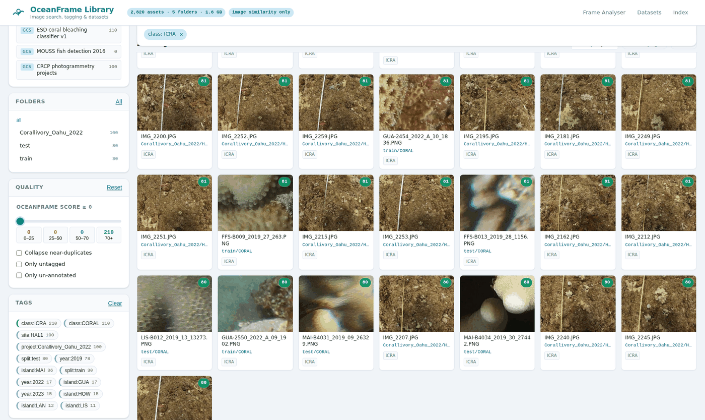
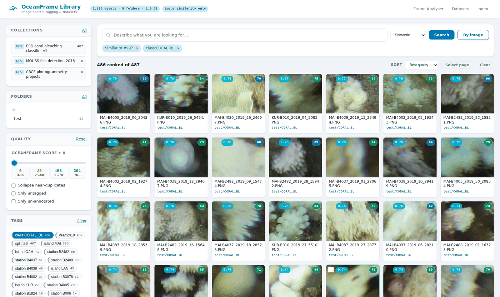
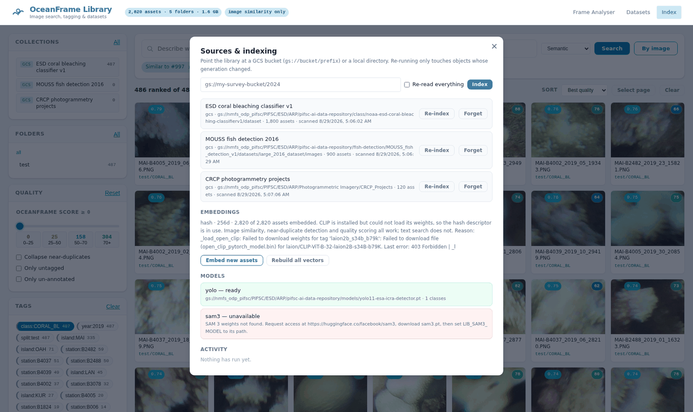

# OceanFrame Image Library

A dense, searchable catalog over an image collection that lives in a Google Cloud
Storage bucket (or a local directory), with CLIP semantic search, YOLO / SAM 3
tagging, OceanFrame quality scoring, and dataset export.

It runs as a second surface inside the existing OceanFrame FastAPI app
(`/library`), so a single deployment gives you both the video/frame analyser and
the library.

---

## 1. Goals

| Goal | How it is met |
| --- | --- |
| Index a dense GCS bucket | Streaming blob listing, incremental by `generation`, resumable jobs, anonymous auth for public buckets |
| Similarity search | CLIP image/text embeddings + cosine ranking over a memmapped matrix |
| Folder structure is meaningful | `folder` is a first-class indexed column: tree browser, prefix scoping, facet counts, and path→tag rules |
| Search with YOLO | Detections stored per asset; filter by class, confidence, and instance count. Models load from a path or a `gs://` URI |
| Search with SAM 3 concepts | Text-prompted concept segmentation writes back concept tags + boxes |
| Tagging | Manual tags, auto tags (model, path rules), tag facets |
| Datasets | Save a query or a selection, assign splits, export YOLO / COCO / CSV / manifest |
| Quality score | OceanFrame blur / brightness / contrast / colour-cast metrics → 0–100 composite |
| Deploy anywhere | Pure-Python default path (no torch); Docker Compose; Google Cloud Workstations bootstrap |
| Prove it on real data | `scripts/noaa_quickstart.sh` builds a 2,800-image catalog from NOAA's public PIFSC bucket; `tests/test_noaa_live.py` runs against it |

## 2. Non-goals

* Not a labelling tool. Boxes come from models or are imported; there is no
  polygon drawing surface.
* Not multi-tenant. Like the rest of OceanFrame it assumes a trusted
  deployment behind IAP / workstation auth.
* Does not mutate the source bucket. The catalog is derived state; the bucket is
  read-only unless you explicitly export back to it.

---

## 3. Architecture

```
                    ┌──────────────────────────────────────────┐
  gs://bucket/…  ─► │ storage backend (gcs | local)            │
                    │   list_objects()  open()  signed_url()   │
                    └───────────────┬──────────────────────────┘
                                    │ bytes
                    ┌───────────────▼──────────────────────────┐
                    │ indexer                                  │
                    │  thumbnail → quality → embed → annotate  │
                    └───────┬───────────────┬──────────────────┘
                            │               │
            ┌───────────────▼───┐    ┌──────▼─────────────────┐
            │ catalog.sqlite    │    │ vectors.f32 (memmap)   │
            │ assets, tags,     │    │ N × D, L2-normalised   │
            │ detections,       │    │ row id ← assets.embed_row
            │ datasets, FTS5    │    └──────┬─────────────────┘
            └───────────────┬───┘           │
                            │               │
                    ┌───────▼───────────────▼──────────────────┐
                    │ search planner:  filter (SQL) → rank (cosine)
                    └───────────────┬──────────────────────────┘
                                    │
                    ┌───────────────▼──────────────────────────┐
                    │ FastAPI /api/library/*  +  /library UI    │
                    └──────────────────────────────────────────┘
```

### 3.1 Why "filter first, rank second"

An ANN index that cannot express `folder LIKE 'survey/2024/%' AND quality > 60
AND has_detection('fish', conf ≥ .4)` forces you to over-fetch and post-filter,
which silently truncates recall on selective queries. Instead the planner:

1. Runs the structured predicates in SQLite and collects the surviving
   `embed_row` ids (SQLite handles hundreds of thousands of rows in
   milliseconds with the right indexes).
2. Gathers just those rows from the memmapped matrix and does an exact cosine
   ranking on them.

Exact scoring on a filtered subset is both simpler and more accurate than
approximate scoring on the full set, and it stays fast because the filter is
usually the selective part. For an unfiltered query over a very large catalog
the planner scans the full matrix in chunks (`VEC_CHUNK_ROWS`), which is
~0.1 s per million rows at D=512 on a modern CPU, and can hand off to `hnswlib`
when it is installed and the catalog exceeds `ANN_MIN_ROWS`.

### 3.2 Embedding backends

`LIB_EMBED_BACKEND` selects one of:

| Backend | Dep | Text search | Notes |
| --- | --- | --- | --- |
| `clip` | `open_clip_torch` or `transformers` + `torch` | yes | Default when available. ViT-B-32 / 512-d. |
| `hash` | none | no | Deterministic 256-d descriptor: 8×8 luma DCT sign bits + RGB/HSV histograms + tiled edge energy. Image-to-image similarity and near-duplicate detection only. |

The `hash` backend exists so the app is fully functional — index, browse,
similarity, quality, tags, datasets — on a machine with no GPU and no torch
wheel, and so CI can exercise the whole pipeline. Swapping to `clip` later only
requires a re-embed pass (`python -m library.cli embed --rebuild`), not a re-crawl: thumbnails,
quality metrics, and tags are preserved.

### 3.3 Annotators

`library/annotate/` defines one interface:

```python
class Annotator(Protocol):
    name: str
    def annotate(self, images: list[Image], prompts: list[str] | None) -> list[list[Detection]]
```

* `yolo` — `ultralytics.YOLO`, any detect/segment/classify checkpoint
  (`LIB_YOLO_MODEL`, default `yolo11n.pt`). Writes `detections` rows plus a
  `class:<name>` auto-tag per distinct label.
* `sam3` — `ultralytics.models.sam.SAM3SemanticPredictor` with `sam3.pt`.
  Promptable concept segmentation: you give it noun phrases
  (`"school of fish"`, `"bleached coral"`) and every instance found becomes a
  detection plus a `concept:<phrase>` tag. SAM 3 weights are gated on Hugging
  Face and are **not** auto-downloaded, so this backend reports
  `unavailable` with an actionable message until `sam3.pt` is present.

Both are optional. Missing `ultralytics` degrades to "annotation unavailable"
rather than breaking indexing.

### 3.4 Quality score

Reuses the existing `core.filters.blur_score` (centre-weighted Laplacian
variance) and `compute_phash` directly — not a reimplementation, so a library
still and a video frame dedupe against each other — and adds brightness / contrast / colour-cast from
`analysis.py`. The composite is a mean of four sub-scores in 0–100:

* **sharpness** — `blur_score` mapped through `log1p(b)/log1p(B_ref)`
* **exposure** — distance of mean luma from the 110–160 comfortable band
* **contrast** — luma standard deviation, saturating at 64
* **colour balance** — |log(R/B)| penalty, tuned so that underwater
  blue-green casts score low but are not zeroed

Weights live in `library/quality.py:WEIGHTS` and are documented inline so a
survey programme can retune them without touching the pipeline.

`phash` doubles as the near-duplicate key: the dedupe view groups assets whose
Hamming distance is `≤ LIB_DUPE_DISTANCE`, which is what makes a dense bucket
(burst-mode transect photography) tractable.

### 3.5 Folder structure as data

Folders are meaningful in survey data, so they are indexed, not just displayed:

* `assets.folder` holds the POSIX prefix relative to the source root, indexed
  for `LIKE 'prefix/%'` scoping.
* `/api/library/folders` returns a tree with counts, and re-computes counts
  against the *current* query so the tree acts as a facet.
* `LIB_PATH_TAG_PATTERN` is a regex with named groups applied to each asset's
  relative path; every group that matches becomes a `key:value` auto-tag. For
  example `(?P<year>\d{4})/(?P<site>[^/]+)/(?P<transect>T\d+)` turns
  `2024/kaneohe/T03/img_0912.jpg` into `year:2024`, `site:kaneohe`,
  `transect:T03` — which are then facetable and searchable like any other tag.

## 4. Data model

```sql
sources(id, kind, root, added_at)                     -- gs://bucket/prefix or /path
assets(id, source_id, uri, folder, name, ext, size, etag, mtime,
       width, height, phash, blur, brightness, contrast, color_cast,
       quality, thumb_path, embed_row, embed_model, indexed_at, status, error)
tags(id, name, kind, color)                           -- kind: manual|class|concept|path
asset_tags(asset_id, tag_id, score, origin)           -- origin: manual|yolo|sam3|path
detections(id, asset_id, label, conf, x, y, w, h, model, mask)  -- mask: normalised polygon JSON
datasets(id, name, notes, spec_json, created_at)
dataset_items(dataset_id, asset_id, split)
jobs(id, kind, status, total, done, message, started_at, finished_at)
assets_fts(name, folder, tags)                        -- FTS5, external content
```

Indexes: `assets(folder)`, `assets(quality)`, `assets(phash)`,
`assets(source_id, etag)`, `detections(asset_id)`, `detections(label, conf)`,
`asset_tags(tag_id)`.

`etag` (GCS `generation`, or `mtime:size` locally) drives incremental
re-indexing: an unchanged blob is skipped without ever being downloaded.

## 5. Deployment

| Target | Entry point |
| --- | --- |
| Local | `pip install -r requirements.txt && python launch.py` → `/library` |
| Docker | `make up` — core image, 451 MB, no torch. `make up-ml` adds the model stack. Named volumes keep the catalog. |
| Docker, real data | `make quickstart && make up` — ~2,800 NOAA images, no credentials |
| Docker, tests | `make test` (offline) and `make test-live` (against the NOAA bucket) |
| Cloud Workstation | `deploy/workstation_setup.sh` — installs deps, wires ADC, systemd unit, and prints the tunnel command |
| CLI / batch | `python -m library.cli index\|embed\|annotate\|search\|dataset` |
| Try it with no bucket | `python scripts/make_demo_library.py /tmp/demo && LIB_SOURCE=/tmp/demo python launch.py` |
| Try it on real NOAA data | `./scripts/noaa_quickstart.sh` (public bucket, no credentials needed) |

Auth on GCP uses Application Default Credentials, so a workstation's attached
service account works with no key material on disk. The bucket needs
`roles/storage.objectViewer`; dataset export back to GCS needs
`roles/storage.objectCreator` on the destination.

## 6. Testing

`python -m pytest` runs the offline suite in `tests/`. It builds a small folder tree of
generated images (including a deliberate near-duplicate) in a temp directory and
exercises the whole pipeline: incremental re-indexing, missing-object handling,
folder scoping and facet counts, tag and detection filters, near-duplicate
collapsing, exact-vs-brute-force vector ranking, split leakage, every export
format, and the HTTP surface. It needs no GPU, no network, and no model weights —
which is the point of the hash backend.

`tests/test_noaa_live.py` runs against the live NOAA bucket, gated behind
`OCEANFRAME_LIVE_TESTS=1`. Each of its cases exists because of a bug found by
pointing the library at real data: anonymous access, uppercase `.PNG`/`.JPG`,
a prefix containing a space, source dimensions on drafted 13 MB frames, preview
bounds and caching, and the resumable meaning of `--limit`.

### Cross-collection search



*One class facet, two collections: `ICRA` detections from NOAA's own model span
both the 6000×4000 photogrammetry frames and the 224px classifier crops, because
detections are indexed against assets rather than against a dataset.*

### Similarity



*"Find similar" from a `CORAL_BL` crop, ranked by cosine over the filtered set.
The badge on each tile is the similarity score; the green badge is the
OceanFrame quality score.*

### Sources and models



*Each source keeps its own path-tag rule and its own last-scanned time.
Re-indexing skips objects whose GCS generation has not changed.*

### Container notes

Neither image installs a system package. `requirements.txt` pins
`opencv-python-headless`, which drops the GUI bindings and with them
`libGL`/`libxcb`; the `ml` target has to swap Ultralytics' full `opencv-python`
back out afterwards, because it installs over the headless build and then fails
at `import cv2` with `libxcb.so.1: cannot open shared object file`.

The app runs as an unprivileged uid on port 8080, and `USER` is set
*numerically* — `USER oceanframe` breaks outright when the build's `UID` matches
an account that already exists (notably `UID=0`), because the `useradd` is
best-effort.

`LIB_MODEL_DIR` is frequently read-only or owned by a different uid — a
bind-mounted `./models` is the common case — so weights already present there
are used from there, while downloads fall back to a writable temp dir with a
warning that says how to make it stick.

## 7. What real data changed

The design above survived contact with `gs://nmfs_odp_pifsc` largely intact, but
seven things only showed up once real imagery went through it. They are listed
here because each one is invisible on synthetic fixtures:

| Found | Fix |
| --- | --- |
| `storage.Client()` needs credentials; NOAA's buckets are public | Anonymous-client fallback (`LIB_GCS_ANONYMOUS=auto`) |
| One global path-tag regex cannot serve three collections in one bucket | `tag_pattern` stored **per source** |
| 6000×4000 frames decoded in 507 ms each | `Image.draft()` DCT-domain scaling → 214 ms, identical phash and score |
| `draft()` mutates `.size`, so source dimensions were recorded post-scale | Read `.size` before drafting |
| 16 crawl workers against a 10-connection urllib3 pool | Pool sized to `CRAWL_WORKERS`; 55 s → 36 s for 2,000 objects |
| Detail view proxied the 13 MB original: 7 s per click | Cached ~1600px preview: 1.3 s cold, 0.2 s warm |
| Detection boxes drawn with `vector-effect` at `stroke-width: 0.45` were hairlines, and the overlay was letterbox-misaligned on non-square frames | Positioned box elements with labels; wrapper shrink-wraps the rendered image |

And one finding that is not a bug but changes how the tool should be used:

> **A COCO checkpoint is worse than useless on reef imagery.** Stock
> `yolo11n.pt` over 500 MOUSS fish frames produced 1,498 confident detections —
> `airplane` ×497, `person` ×477, `skateboard` ×272 — and not one was right.
> NOAA publishes `yolo11-esa-icra-detector.pt` in the same bucket, so
> `LIB_YOLO_MODEL` accepts `gs://` URIs and caches the weights locally. That
> model found `ICRA` in 210 images at 0.50 mean confidence.

Quality scoring behaved sensibly across genuinely different gear, which is the
main thing the composite had to prove:

| Collection | Native size | Mean quality |
| --- | --- | --- |
| CRCP photogrammetry (DSLR, strobes) | 6000×4000 | 83.4 |
| Coral bleaching crops | 224×224 | 66.8 |
| MOUSS deep-water stereo camera | 968×728 | 55.0 |

Every asset is measured at the same working resolution
(`LIB_WORK_MAX_EDGE`), which is what makes that comparison meaningful — the
blur metric is strongly resolution-dependent, so scoring at native size would
have ranked the 24 MP camera top on sharpness alone regardless of content.

## 8. What is not covered by the tests

* **CLIP inference.** The code path is exercised only by its fallback. Verifying
  it needs the weights, which means network access to the model host.
* **SAM 3.** The adapter is written against
  `ultralytics.models.sam.SAM3SemanticPredictor`, but the weights are
  access-gated on Hugging Face and cannot be fetched automatically, so the
  annotator reports itself unavailable until you supply `sam3.pt`.
* **Authenticated GCS.** The anonymous path is covered live against NOAA's
  public bucket; the ADC path needs credentials and a private bucket.
